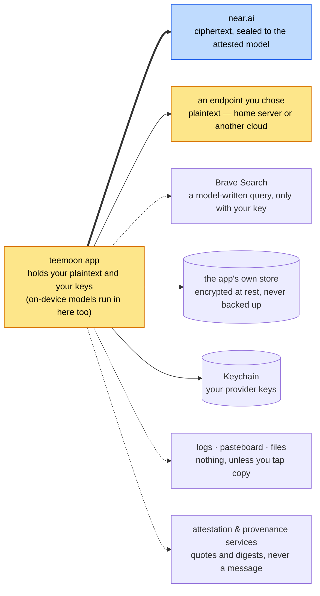

> **teemoonai/audits** — client architecture. Companion to the server-side
> map in [`/notes/ARCHITECTURE.md`](/notes/ARCHITECTURE.md). Method:
> [`method.md`](method.md) · Pages: [`README.md`](README.md).

# Client Architecture — Every Way Out of the App

On the server the map shows which processes see plaintext, because only two
do. On the device that question has a one-word answer: the app does. It
composes every prompt, decrypts every reply, and holds every key. So the
client map is not about what touches plaintext. It is about **the exits** —
every way anything can leave the app — and what each one is allowed to carry.

Solid arrows carry your data by design. Dotted arrows must never carry a
message or a key, and each release page checks that they don't. A finding is
any arrow that is not in this picture, or a dotted arrow carrying what it must
not.

---

## The exits, and the answer at the current pin

| Exit | Carries, by design | Must never carry | At `v1.0.2` |
|---|---|---|---|
| **near.ai** | your messages, sealed on the device to the attested model's key; your near.ai key as the request's identity | plaintext — sealing fails closed, never falls back | clean |
| **An endpoint you chose** (home server, Grok, Fireworks, custom) | plaintext, because you sent it there; the key you paired with it | anything to a second host | clean — by-design residual: that endpoint reads it |
| **On-device model** | nothing leaves the process | — | clean for the app's code; the native runtime is a binary, **not traced** |
| **Brave Search** | a search query the model writes, only if you added a Brave key | a fetched result URL; anything without your key | clean — by-design residual: the model chooses the words |
| **The app's own store** | every message, twice (store + search index) | an unprotected or backed-up copy | clean — `.completeUnlessOpen`, backup-excluded, re-applied each launch |
| **Keychain** | provider keys | a key anywhere else on disk | clean — by-design residual: keys restore through an encrypted backup |
| **Logs** | counts, provider names, fixed strings | message text or a key at any privacy level | clean |
| **Pasteboard** | what you tap copy on; keys only to a local, expiring pasteboard | anything without a tap | clean |
| **Files** | model weights, download bookkeeping, the providers file | message text, a key | clean — one env-gated developer log capture ships in the binary, unreachable without developer tooling |
| **Attestation & provenance services** (near.ai reports, Intel, NVIDIA, GitHub, Sigstore, this repo) | quotes, nonces, digests, a chat id | a message; a key to anyone but near.ai | clean |
| **Renderer** | — (it draws; it must not fetch) | a URL from a reply, fetched with no tap | clean — the one HIGH in the client's history, fixed before 1.0 |

Evidence for every cell is on the [release page](teemoon-ios/v1.0.2-21d534e.md).

---

## The entries

Three things can start a send: the composer, a Siri or Shortcuts request, and
a re-ask after the app returns from the background. All three go through one
definition of "may this be sent" — `ConfidentialSession.sendPolicy` — and an
attested provider with no sealed channel is refused, never sent in the clear.
A second definition of that rule is how Siri once bypassed it.

## Keys, in three lines

A key lives in the Keychain and nowhere else on disk. It leaves the device
only inside a request to the provider it belongs to. It is shown only where
you open it — the entry field's reveal toggle and the developer debug panel —
and copies of it are redacted or expire.

## What to keep watching

1. **The renderer.** The one HIGH was a renderer feature nobody aimed at the
   network. Any new way of drawing a reply reopens the question.
2. **New entries.** Every new way a message can start must use the one gate.
3. **New tools.** A model-callable tool is a way for a hostile model to send
   the conversation somewhere. One that fetches a URL it chose, or reads other
   threads, changes the verdict.
4. **The native runtime.** Plaintext goes into a binary. Until someone
   observes it running, every page says so.
