> **teemoonai/audits** — client architecture. Companion to the server-side
> map in [`/notes/ARCHITECTURE.md`](/notes/ARCHITECTURE.md). Method:
> [`method.md`](method.md) · Pages: [`README.md`](README.md).

# Client Architecture — The Device, and Every Way Out of It for Keys and Messages

On the server the map shows which processes see plaintext, because only two
do. On the device that question has a one-word answer: the app does. It
composes every prompt, decrypts every reply, and holds every provider key. So
the map shows the app's parts, and the question it serves is **the exits** —
every way anything can leave the app — asked twice for each one: what
**keys** may cross it, and what **messages** may. Keys first: a key has one
legitimate resting place (the Keychain) and one legitimate direction of
travel (a request to its own provider), it is the asset most easily leaked by
accident, and it is directly monetisable. The key path and key table beneath
the diagram answer that; the exits table that follows answers the second.

```mermaid
flowchart TB
    subgraph dev["YOUR iPHONE (no enclave — the app holds plaintext)"]
        UI["Composer · transcript · ChatViewModel"]
        STORE[("SwiftData store + FTS sidecar (-wal/-shm)")]
        ENGINE["GenerationEngine (tool rounds, shared by every place)"]
        E2EE["HTTPTransport + E2EEPeer — SEALS here"]
        PLAIN["HTTPTransport — plain (home / custom / other clouds)"]
        LOCAL["LiteRTTransport → LiteRT native runtime (in-process)"]
        RENDER["Textual markdown renderer (no remote fetch)"]
        SIRI["Siri / Shortcuts — RequestLLMIntent"]
        TOOLS["web_search tool (opt-in Brave key)"]
        VERIFY["Attestation verifiers (quotes, nonces, digests)"]
        KEYS[("Keychain — provider keys")]
        LOG["os Logger (content-free) · DiagLog (env-gated)"]
        PB["Pasteboard: general (user copy) · local+expiring (keys)"]
        UI --> STORE
        UI --> ENGINE
        SIRI --> ENGINE
        ENGINE --> E2EE
        ENGINE --> PLAIN
        ENGINE --> LOCAL
        ENGINE --> TOOLS
        ENGINE --> RENDER
        KEYS --> E2EE
        KEYS --> PLAIN
    end

    subgraph near["near.ai (sealed TDX fleet — the server-side map)"]
        GW["gateway CVM (ciphertext only)"]
        MN["model node: vllm-proxy-rs decrypts → SGLang"]
    end
    subgraph other["Endpoints you chose — plaintext by definition"]
        HOME["home: ollama / LM Studio / any OpenAI-compatible server"]
        CLOUD["other clouds: Grok · Fireworks · custom"]
    end
    subgraph attest["Attestation & provenance services (no message content)"]
        NAI["near.ai attestation + signature endpoints"]
        PCS["Intel PCS"]
        NRAS["NVIDIA NRAS"]
        GH["GitHub API / raw · Sigstore/Rekor · teemoonai/audits index"]
    end
    BRAVE["Brave Search (opt-in, fixed host)"]
    HF["Hugging Face (model weights in)"]

    E2EE -->|"TLS · E2EE ciphertext"| GW --> MN
    PLAIN -->|"TLS · plaintext"| HOME
    PLAIN -->|"TLS · plaintext"| CLOUD
    TOOLS -.->|"model-authored query"| BRAVE
    VERIFY -.-> NAI
    VERIFY -.-> PCS
    VERIFY -.-> NRAS
    VERIFY -.-> GH
    LOCAL -.->|"background download (weights only)"| HF

    classDef plaintext fill:#fde68a,stroke:#d97706,color:#000
    classDef ciphertext fill:#bfdbfe,stroke:#2563eb,color:#000
    classDef mustbeclean fill:#fecaca,stroke:#dc2626,color:#000
    classDef keys fill:#ddd6fe,stroke:#7c3aed,color:#000
    class UI,STORE,ENGINE,E2EE,PLAIN,LOCAL,RENDER,SIRI,TOOLS,MN,HOME,CLOUD plaintext
    class GW ciphertext
    class LOG,PB mustbeclean
    class KEYS keys
```



**Yellow = holds your plaintext.** Everything inside the app that touches a
message is yellow by construction, and so is the store: data protection
encrypts it at rest and keeps it out of backups, but to the app, and to anyone
who unlocks the phone, it is every message you ever sent. **Red = must stay
content-free:** the log and the pasteboard are the sinks a leak would land in,
and each page verifies that no message reaches them without a user tap.
**Purple = keys,** not messages; they have their own residuals. **Blue** is
the ciphertext-only gateway from the server-side map. The endpoint you chose
outside near.ai is yellow because it reads your plaintext by definition.

---

## Keys — the first thing on the device worth stealing

A key is entered once and used on every request. It is meant to have one
resting place and one direction of travel:

```
[keyboard]  SecureField, reveal toggle          Views/Settings/ProviderConnectionSection.swift
    ▼
Keychain — AfterFirstUnlock, not synced           Providers/Keychain.swift
    │       (the providers file holds only the id)
    ├──▶ request header, ONLY to the key's own provider   (twelve sites; the page lists them)
    │        └──▶ and, uninvited, the shared URL cache on disk   ← MEDIUM, every release
    ├──▶ copy: local-only, expiring pasteboard         Views/PlatformChrome.swift
    ├──▶ debug panel: verbatim on screen when you open it; redacted on copy; never persisted
    └──▶ self-verify script: reads the key from the environment, never embeds it
```

| Hop (key present) | Must never happen | At `v1.0.2` |
|---|---|---|
| Entry field | Passwords autofill capturing it | clean — classed as a one-time code; the reveal toggle is user-held |
| Keychain | sync; a key anywhere else on disk | by design: restores with an encrypted backup, no iCloud sync. **MEDIUM:** also on disk in the URL cache |
| Request headers | a host that is not the key's provider | clean — all twelve sites; the certificate-agnostic TLS probe carries no key (fixed pre-1.0) |
| Shared URL cache | any authenticated request archived | **MEDIUM, fixed in 1.0.3** — the attestation-report fetch is archived with its `Authorization` header, nine copies after one session; zero at 1.0.3 |
| URL query strings | a key in a URL | clean |
| Logs | a key at any privacy level | clean — the Keychain logs the account name, never the value |
| Error and debug records | persisted or copied unredacted | clean — memory-only; verbatim on screen by design; redacted on every copy path |
| Pasteboard | a broadcast or a plain copy | clean — local-only, expires |
| Exported script | the key embedded | clean — read from the environment |

## The exits, and the answer at the current pin

Messages, walked exit by exit as the keys were above.

| Exit | Carries, by design | Must never carry | At `v1.0.2` |
|---|---|---|---|
| **near.ai** | your messages, sealed on the device to the attested model's key; your near.ai key as the request's identity | plaintext — sealing fails closed, never falls back | clean |
| **An endpoint you chose** (home server, Grok, Fireworks, custom) | plaintext, because you sent it there; the key you paired with it | anything to a second host | clean — by-design residual: that endpoint reads it |
| **On-device model** | nothing leaves the process | — | clean for the app's code; the native runtime is a binary, **not traced** as source. Added 2026-09-10: its shipped bytes were checked — no HTTP stack linked, and no code path in it reaches its socket layer; a dynamic capture on a phone is still to do |
| **Brave Search** | a search query the model writes, only if you added a Brave key | a fetched result URL; anything without your key | clean — by-design residual: the model chooses the words |
| **The app's own store** | every message, twice (store + search index) | an unprotected or backed-up copy | clean — `.completeUnlessOpen`, backup-excluded, re-applied each launch |
| **Keychain** | provider keys | a key anywhere else on disk | **MEDIUM, fixed in 1.0.3** — the near.ai key is also written to the shared URL cache on disk by the attestation-report fetch; by-design residual: keys restore through an encrypted backup |
| **Logs** | counts, provider names, fixed strings | message text or a key at any privacy level | clean |
| **Pasteboard** | what you tap copy on; keys only to a local, expiring pasteboard | anything without a tap | clean |
| **Files** | model weights, download bookkeeping, the providers file, UserDefaults | message text, a key | **LOW** — the user-edited system prompt is in UserDefaults, inside backups; **MEDIUM** — the URL cache holds the near.ai key; one env-gated developer log capture ships in the binary, unreachable without developer tooling |
| **Attestation & provenance services** (near.ai reports, Intel, NVIDIA, GitHub, Sigstore, this repo) | quotes, nonces, digests, a chat id | a message; a key to anyone but near.ai | clean |
| **Renderer** | — (it draws; it must not fetch) | a URL from a reply, fetched with no tap | clean — the one HIGH in the client's history, fixed before 1.0 |

Evidence for every cell is on the [release page](teemoon-ios/v1.0.2-21d534e.md).

---

## The entries

Three things can start a send: the composer, a Siri or Shortcuts request, and
a re-ask after the app returns from the background. All three go through one
definition of "may this be sent" — `ConfidentialSession.sendPolicy` — and an
attested provider with no sealed channel is refused, never sent in the clear.
A second definition of that rule is how Siri once bypassed it.

## What to keep watching

1. **The renderer.** The one HIGH was a renderer feature nobody aimed at the
   network. Any new way of drawing a reply reopens the question.
2. **New entries.** Every new way a message can start must use the one gate.
3. **New tools.** A model-callable tool is a way for a hostile model to send
   the conversation somewhere. One that fetches a URL it chose, or reads other
   threads, changes the verdict.
4. **The native runtime.** Plaintext goes into a binary. A live near.ai
   session has now been observed opening no unlisted endpoint; an on-device
   session has not. Added 2026-09-10: its shipped bytes have been checked —
   no networking framework, and no code path reaches the socket layer the
   Rust standard library brings along. Re-run that check on every LiteRT-LM
   bump; a version that gains a caller of `TcpStream::connect` changes the
   verdict.
5. **The shared URL session.** Anything authenticated that goes through it
   can land on disk if the server allows caching. Found by running the app,
   not by reading it — the reason the method now requires a runtime pass.
