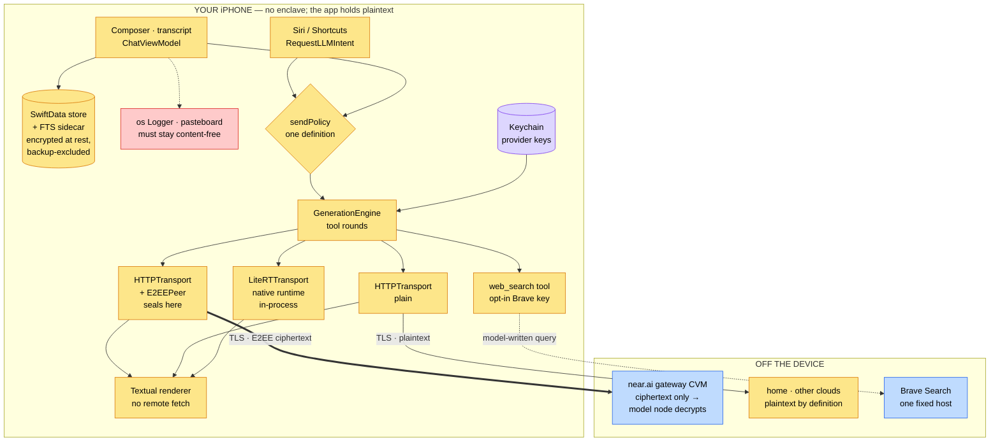

> **teemoonai/audits** — device architecture + cleartext hot path (client side).
> Companion to the server-side map in [`/notes/ARCHITECTURE.md`](/notes/ARCHITECTURE.md).
> Method: [`method.md`](method.md) · Pages: [`README.md`](README.md).

# Client Architecture — Where Plaintext Lives on the Device

The server-side map shows plaintext confined to two containers inside a sealed
enclave. On the device there is no enclave: the app **is** the plaintext
holder, and the operating system, the pasteboard, the file system, and every
network stack the app can reach are the places it could go. This map names
each of them, so a page can say which it cleared and which it did not.

---

## 1. The device is the other yellow box



**Yellow = holds your plaintext.** Everything inside the app that touches a
message is yellow by construction, and so is the store: data protection
encrypts it at rest and keeps it out of backups, but to the app, and to anyone
who unlocks the phone, it is every message you ever sent. **Red = must stay
content-free:** the log and the pasteboard are the sinks a leak would land in,
and each page verifies that no message reaches them without a user tap.
**Purple = keys,** not messages; they have their own residuals. **Blue** is
the ciphertext-only gateway from the server-side map. The endpoint you chose
outside near.ai is yellow because it reads your plaintext by definition.

Not drawn, because they never carry a message: the app's attestation and
provenance traffic (near.ai report and signature endpoints, Intel PCS, NVIDIA
NRAS, GitHub, Sigstore, this repo's index) and the model-weight download from
Hugging Face. They are in the table below so a page still has to clear them.

---

## 2. What runs where, and what sees plaintext

| Component | Files (at `v1.0.2`) | Sees your plaintext? | The sink question |
|---|---|---|---|
| Composer, transcript, view model | `Views/Chat/*`, `Chat/ChatViewModel.swift` | Yes — composes prompts, holds replies | Does it write anywhere but the protected store; does it log content |
| Conversation store + search index | `App/teemoonApp.swift` (hardening), `Chat/Search/*` | Yes — every message at rest, twice (store + FTS) | Protection class and backup exclusion on the store **and** each sidecar, re-applied each launch |
| Generation engine | `Inference/GenerationEngine.swift` | Yes — the tool-round loop | Which tools it offers the model, and what those tools can reach |
| near.ai transport | `Inference/HTTPTransport.swift`, `Confidential/E2EEPeer.swift`, `XChaChaPoly.swift` | Yes, until it seals | Does sealing fail **closed**; is send-authorization a single choke point |
| Plain transport (home / other clouds) | same `HTTPTransport`, `Providers/Adapters/*` | Yes — sends plaintext to the endpoint you configured | Only that endpoint; no second destination |
| On-device inference | `Inference/LiteRTTransport.swift`, `LocalRuntime.swift`, `Packages/LiteRTLM`, the `CLiteRTLM` xcframework | Yes — the model runs in-process | The native binary's own logging and file writes (not readable as source) |
| Renderer | `Vendor/textual`, `Views/Chat/MarkdownParseCache.swift`, `NoRemoteAttachmentLoader.swift` | Yes — renders replies | Any fetch of a content-supplied URL on render, no tap |
| Siri / Shortcuts | `App/RequestLLMIntent.swift` | Yes — a second entry to the send path | Consults the same gate as the composer |
| Model-callable tools | `Inference/BraveWebSearchTool.swift` | Yes — the model writes the query from the conversation | Fixed host, opt-in key, never fetches result URLs |
| Keychain, config store | `Providers/Keychain.swift`, `ConfigStore.swift` | Keys only | Accessibility class, sync, and whether a key ever lands in the JSON |
| Pasteboard | `Views/PlatformChrome.swift` (`copySensitive`), copy buttons | Keys and user-chosen text | Secrets confined to a local, expiring pasteboard; content copies are user-initiated |
| Logs, diagnostics | every `Logger(subsystem: "ai.teemoon")`, `DiagLog`, `Support/MainThreadHangReporter.swift`, `Views/Chat/ScrollTrace.swift`, `captureNativeLogIfAsked` | Structurally could | No content at any privacy level; DEBUG-fenced or env-gated diagnostics, and what they capture |
| Verification egress | `Confidential/*Service.swift`, `ImageProvenance.swift`, `AuditIndex.swift`, `TEESignatureVerifier.swift` | No — quotes, nonces, digests, chat ids | Confirm no message bytes ride any of it; note which carry the provider key |
| Model downloads | `Providers/LocalModelDownloadSession.swift`, `LocalModelCatalog.swift` | No | Bare request to a compiled catalog URL; nothing from the conversation |

Three "places" a model can run, and what that means for the question:

- **near.ai** — sealed to the attested model key on the device; the gateway
  relays ciphertext. This is the only place where "private from the provider"
  is a claim the app can make, and the server-side pages audit the far end.
- **home / custom / other clouds** — plaintext over TLS to the endpoint you
  configured. Private from *everyone else*, but the endpoint reads it by
  definition. The client's job is to send it nowhere else and to never render
  that path as sealed.
- **on-device** — plaintext never leaves the phone by construction. The
  residual is the native runtime binary the app links, which source review
  cannot read.

---

## 3. The cleartext hot path on the device

```
[keyboard]  compose plaintext prompt
    │
    ▼
ChatViewModel ──▶ SwiftData store (+ FTS index, -wal/-shm)   ← encrypted at rest
    │              (.completeUnlessOpen, backup-excluded, re-hardened each launch)
    │
    ├── sendPolicy gate (ONE definition; composer AND Siri consult it) ──▶ refuse / confirm / allow
    ▼
GenerationEngine (tool rounds; may offer `web_search` if you configured a Brave key)
    │
    ├─ near.ai ─────▶ HTTPTransport → E2EEPeer.seal (throws on failure; never falls back to plaintext)
    │                    │  ephemeral URLSession, no cookie/cache persistence
    │                    ▼
    │               CIPHERTEXT ──TLS──▶ gateway ──▶ model node (the server-side map takes over)
    │
    ├─ home / custom / other cloud ─▶ HTTPTransport → PLAINTEXT ──TLS──▶ the endpoint you chose
    │
    └─ on-device ───▶ LiteRTTransport → LiteRT native runtime, in-process (no network)
                                                    │
    ◀──────────────── reply (decrypted for near.ai; signature checked, advisory) ◀──┘
    │
    ▼
ChatGeneration ──▶ transcript renderer (Textual; image URLs stripped, loader disabled)
    │                                              ──▶ screen
    └──▶ SwiftData store (same protection)
```

**Plaintext exists in exactly one place the app controls: its own process and
its own protected store.** Every arrow that leaves the process is either the
send path you aimed at, or carries no message. The findings and residuals on
each page are the exceptions found to that sentence, and the checks that keep
it true.

---

## 3b. The key path — the second thing on the device worth stealing

A provider key is entered once and then used on every request. It has exactly
one legitimate resting place and one legitimate direction of travel.

```
[keyboard]  SecureField (reveal toggle → plain TextField)   Views/Settings/ProviderConnectionSection.swift
    │
    ▼
Keychain — kSecAttrAccessibleAfterFirstUnlock, not synchronizable,     Providers/Keychain.swift
    │       account = provider id; the providers JSON holds the id only  Providers/ConfigStore.swift
    │
    ├── ProviderStore.credential(for:)  ──▶  request header, ONLY to the key's own provider:
    │       near.ai key  → cloud-api.near.ai / *.completions.near.ai  (chat, model catalog,
    │                      attestation reports, per-reply signature fetch)
    │       Brave key    → api.search.brave.com                     (key check, web_search)
    │       Fireworks / xAI / custom key → the base URL you configured with it
    │
    ├── copy button  ──▶  Clipboard.copySensitive: local-only, expires   Views/PlatformChrome.swift
    │
    ├── debug panel  ──▶  headers verbatim ON SCREEN (developer feature, user opens it)
    │                     redacted ON COPY in every build               Views/Chat/DebugHeaderRedaction.swift
    │                     memory-only; never written to the store
    │
    └── self-verify script ──▶ key read from the environment at run time, never embedded
```

What must never happen, and is checked on every page: a key in a log line at
any privacy level; a key in a URL query; a key to a host that is not its own
provider (the TLS-attestation probe once carried it — fixed before 1.0); a key
in the config JSON or any file; a key on the general pasteboard; a key in an
exported artifact.

---

## 4. Where cleartext could leak — and the answer per hop

For each place plaintext exists on the device, the page for a release asks: does
it reach a log, an unprotected or backed-up file, the pasteboard, or a network
destination other than the send path? One-line answers at the current pin
(`v1.0.2`); evidence is on the page.

| Hop (plaintext present) | Could it leak? | Answer at `v1.0.2` | Detail |
|---|---|---|---|
| Composer / view model | Logs | Clean | Every `Logger` line interpolates literals, counts, provider names; no message text at any privacy level |
| Store + FTS sidecar | Backup, weaker sidecar | Clean | Store, `-wal`, `-shm`, and the FTS index all `.completeUnlessOpen` + backup-excluded, re-applied at launch |
| Send gate | A second entry that skips it | Clean (fixed pre-1.0) | `ConfidentialSession.sendPolicy` is the only definition; composer, retry-on-return, and Siri consult it |
| E2EE seal | Fail-open to plaintext | Clean (fixed pre-1.0) | Seal throws, and an unchanged body throws; attested provider with no peer is refused |
| Plain transports | A second destination | Clean, by-design residual | Only the configured endpoint; an unattested provider is plaintext by definition |
| On-device runtime | Native logging / files | **Not traced** | The `CLiteRTLM` binary is not source; its stderr goes nowhere unless a developer launches with `TEEMOON_NATIVE_LOG=1` |
| Renderer | No-tap fetch of a content URL | Clean (**HIGH found & fixed pre-1.0**) | `imageURL` stripped in the one shared parser; non-fetching loader at both hosting roots; regression-tested |
| Siri / Shortcuts | Bypass of the gate | Clean (fixed pre-1.0) | Refuses on anything but `.allow`; missing-key guard sits behind the gate |
| `web_search` tool | Content-driven egress | By-design residual | Model-authored query to one fixed Brave host, only with your key; result URLs are never fetched |
| Keychain | Sync / backup | By-design residual | `AfterFirstUnlock`, not `ThisDeviceOnly`, not synchronizable: keys restore via encrypted backup; never in the config JSON |
| Pasteboard | Broadcast of secrets / silent copy | Clean | Keys via a local, expiring pasteboard; content copies are user-taps on visible text; debug copy redacts credentials unconditionally |
| Diagnostics | Release-binary capture | By-design residual | Hang and scroll traces are `#if DEBUG`; the stderr→`Documents/native.log` capture is env-gated in the Release binary and unreachable without developer tooling |
| Verification egress | Message bytes in a report | Clean | Quotes, nonces, digests, chat ids; the signature fetch carries your near.ai key to near.ai itself |
| Model downloads | Content in the request | Clean | Bare request to a compiled catalog URL; weights land backup-excluded |
| Third-party pipes | Analytics / crash SDK | Clean | None in `Package.resolved`; no app extensions, widgets, or share targets exist |

### 4b. Where a key could leak — and the answer per hop

| Hop (key present) | Could it leak? | Answer at `v1.0.2` | Detail |
|---|---|---|---|
| Entry field | Autofill, snapshot | Clean, one note | `SecureField` classed as one-time-code so Passwords never captures it; the reveal toggle shows plain text while the user holds it open |
| Keychain | Sync, backup | By-design residual | `AfterFirstUnlock`, not `ThisDeviceOnly`, not synchronizable: no iCloud Keychain sync; restores with an encrypted backup |
| Config JSON | Key at rest outside the Keychain | Clean | Holds the provider id; the key is looked up by it |
| Request headers | A host that is not the key's provider | Clean (fixed pre-1.0) | Twelve header sites, each to the key's own provider or the endpoint configured with it; the certificate-agnostic TLS probe carries no key |
| URL query strings | Key in a URL | Clean | No query item carries a key; the copy path also masks known key parameters as a belt |
| Logs | Key interpolated | Clean | No `Logger` line interpolates a key; the Keychain logs the account name at `.private` on failure, never the value |
| Error / debug structs | Key surfaced | Clean, by design on screen | Tool and transport errors carry request headers into the debug panel; shown verbatim on screen (a developer feature the user opens), redacted on copy unconditionally, held in memory only |
| Pasteboard | Broadcast | Clean | Key copy is local-only and expires; no Handoff |
| Exported script | Key embedded | Clean | The self-verify script takes the key from an environment variable |
| Test seeding | Shipping build | Clean | `#if DEBUG` and `--uitesting` |

---

## 5. The things to keep watching

1. **The renderer is the thin part.** The one HIGH in the client's history was a
   renderer feature (auto-loading images) that no one had aimed at the network.
   Any new renderer capability — link previews, favicons, embeds, a web view —
   re-opens the no-tap fetch question, and the vendored `Vendor/textual` tree
   must be re-read whenever it is bumped.
2. **Entry points multiply.** Siri once bypassed the gate because it derived its
   own verdict. Every new way a message can start — a widget, a share sheet, a
   Shortcut, a URL scheme, a re-ask after backgrounding — must consult
   `sendPolicy` and nothing else.
3. **Model-callable tools are content-driven egress.** `web_search` is opt-in and
   pinned to one host; a tool that reads other threads was excised before 1.0
   pending its own review and is absent at `v1.0.2`. A tool that can fetch a
   model-chosen URL, or read beyond the current thread, changes the verdict.
4. **The native runtime is unread.** Plaintext goes into `CLiteRTLM` in-process.
   Its logging and file behaviour are a binary's, and every page carries that as
   *not traced* until someone reads it.
