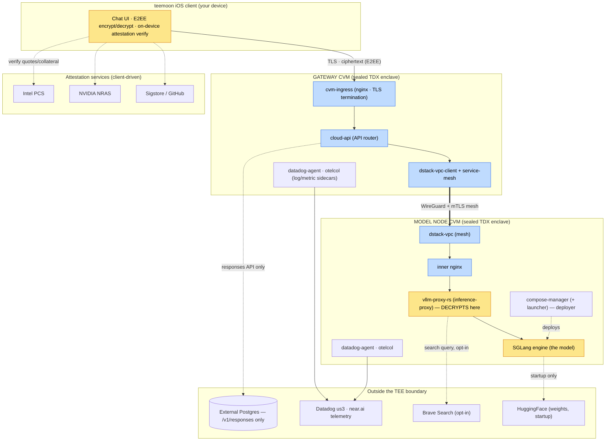

> **teemoonai/audits** - deployment architecture + cleartext hot path.
> From the teemoon privacy-audit run of 2026-07-15. Method: [/notes/method.md](/notes/method.md).

# Inference-Path Architecture — Deployment & Cleartext Hot Path

A birds-eye map of the near.ai confidential-inference deployment: which images
run where, how they are connected, and — the load-bearing question for privacy —
**where your message plaintext (cleartext) actually exists** as it travels from
the teemoon app to the model and back.

> Companion to the per-image audits in this folder and to the method in
> [`/notes/method.md`](/notes/method.md). Scope (image → source commit) was
> re-derived from live attestation on 2026-07-15; see [`README.md`](README.md).

---

## 1. The two sealed machines

Everything server-side runs inside **two hardware-sealed confidential VMs (CVMs)**
— Intel TDX enclaves whose contents are measured and remotely attestable. The
host operator cannot read enclave memory; the audit's job is to confirm the code
*inside* each enclave does not copy plaintext to somewhere the operator (or a
third party) *can* read.



**Yellow = a process that handles your plaintext.** Blue = a process that, on the
path teemoon uses, only ever sees ciphertext. Note that on the **E2EE path the
entire gateway CVM is blue**, and so is the inner `nginx` — it terminates only the
transport TLS while the E2EE/OHTTP payload stays sealed to the model key. Plaintext
is confined to your device and the two model-node containers *behind* that nginx:
`vllm-proxy-rs` (which decrypts) and `SGLang`.

---

## 2. What runs in each place

| Location | Images / components | Sees your plaintext? |
|---|---|---|
| **Your device** | teemoon iOS app | Yes — it composes the prompt and decrypts the reply (structural, both ends of E2EE) |
| **Gateway CVM** | `cvm-ingress`, `cloud-api`, `dstack-vpc-client` + service-mesh, datadog/otel sidecars | **E2EE path: no** (ciphertext only). Degraded path: yes, as pass-through |
| **Model node CVM** | `compose-manager` (+ launcher), `vllm-proxy-rs`, inner `nginx`, **SGLang engine**, `dstack-vpc`, datadog/otel sidecars | `vllm-proxy-rs` decrypts → **SGLang** is where plaintext legitimately lives. `compose-manager` deploys code but never sees messages |
| **Outside the TEE** | External Postgres, Datadog `us3`, `telemetry.infra.near.ai`, Brave, HuggingFace | Postgres: only `/v1/responses` (teemoon never calls it). Telemetry: metadata/logs, verified content-free. Brave: opt-in search query. HF: weights in |

The mesh between the two CVMs is a **WireGuard tunnel with an RA-TLS mTLS layer
on top**, admitted through a Headscale control plane — see
`dstack-vpc.md`.

---

## 3. The cleartext hot path

This is the sequence a single chat message follows. Two cases matter, because
plaintext lives in very different places depending on whether E2EE is in force.

### 3a. E2EE path — what teemoon actually uses

```
[your device]  compose plaintext prompt
      │        encrypt each field with XChaCha20-Poly1305 to an Ed25519 key
      │        that is cryptographically bound to the model node's TDX quote
      ▼
   CIPHERTEXT ──TLS──▶ cvm-ingress ──▶ cloud-api ──WireGuard+mTLS──▶ model node
                       (ciphertext)     (ciphertext,                  (ciphertext
                                         forwards E2EE headers)         in transit)
                                                                          │
                                              inner nginx (terminates transport TLS;
                                              body still E2EE/OHTTP ciphertext)
                                                                          │
                                                        vllm-proxy-rs DECRYPTS here
                                                                          ▼
                                                                    ▶▶ PLAINTEXT ◀◀
                                                                        SGLang
                                                                   (inference runs on
                                                                    plaintext, in-enclave)
                                                                          │
                                              response signed + re-encrypted to your key
                                                                          ▼
   CIPHERTEXT ◀────────────────────── back along the same hops ──────────┘
      │
[your device]  decrypt · verify response signature (advisory)
```

**Plaintext exists in exactly two places on this path:** your device, and — inside
the model node, *behind* the inner nginx — `vllm-proxy-rs` after it decrypts and
`SGLang`. The whole gateway CVM and the inner nginx see only ciphertext: nginx
terminates the transport TLS, but the E2EE/OHTTP payload stays sealed to the model
key until the proxy decrypts it, and none of those hops hold the key. This is why
the gateway-side findings do not touch message content for teemoon.

### 3b. Degraded (non-E2EE) path — teemoon avoids this

If a request is *not* E2EE (a different client, or teemoon during a cold-start
window — the client review is not published in this repo), the picture changes:

```
[device] PLAINTEXT ──TLS──▶ cvm-ingress ──▶ cloud-api ──mesh──▶ model node ──▶ SGLang
                            (plaintext,      (plaintext,        (WireGuard-        (plaintext)
                             TLS-terminated)  pass-through)      wrapped, but
                                                                 gateway-readable
                                                                 content)
```

Now plaintext transits **cvm-ingress and cloud-api** as well. Both are audited to
treat it as opaque pass-through bytes and to keep it out of logs/telemetry/disk —
but this is the path where the gateway components' content-handling matters, and
where the mesh's confidentiality is truly load-bearing.

---

## 4. Where cleartext could leak — and the answer per hop

For each place plaintext (or, off the E2EE path, gateway-readable content) exists,
the audit asks: does it reach a log, a disk, a database, a telemetry exporter, or
a network destination other than the legitimate next hop? Full evidence is in each
image's file; the one-line answers:

| Hop (plaintext present) | Could it leak? | Verdict | Detail |
|---|---|---|---|
| teemoon (device) | Logs / at-rest store / egress | Protected (in-app); Siri intent CRITICAL | At-rest store now protected + backup-excluded; no telemetry SDKs. Gaps: Siri/Shortcuts sends plaintext, and a cold-start window can send non-E2EE without confirmation | teemoon client — reviewed in the teemoon project, not published here |
| cvm-ingress (degraded only) | Access logs / body spool | PRIVATE (qualified) | Logs are metadata-only; but request bodies >16 KB transiently spool to nginx temp files (`proxy_request_buffering` left on) | cvm-ingress |
| cloud-api (degraded only) | Logs / persistence | PRIVATE (stateless) / LEAKS (stateful) | Stateless `/v1/chat/completions` stores no content; stateful `/v1/responses` persists to external Postgres and ignores `store:false` (teemoon never calls it) | cloud-api — gateway-side, out of this repo's scope rule |
| mesh (transit) | Capture / weak admission | PRIVATE (structural caveats) | WireGuard+mTLS, no content logged; caveats are peer-admission and a pre-send app_id check | dstack-vpc |
| vllm-proxy-rs (decrypts) | Logs / cache / egress | PRIVATE (2 opt-in egress) | Content-free logs/cache by construction; Fusion + Brave widen egress only when opted in | [inference-proxy](/images/docker.io/nearaidev/vllm-proxy-rs/sha256-b183677a5d32267539b9b21ec45327a4f3be0a013afeb608c68c4d76e9472e36.md) |
| SGLang (the model) | Request logging / disk / egress | PRIVATE at deployed flags | Request logging off, KV cache RAM-only; 2 rare content-bearing log lines (watchdog stall, tool-parser warning) | [sglang](/images/docker.io/lmsysorg/sglang/sha256-aac6b242680daeb74d2ab1d85f70575357552d7d165d2e5d30eb362797db54a1.md) |
| compose-manager | Deploys the above | COMPROMISABLE by credentialed operator | Never sees messages, but a caller `env` map is applied un-attested; reachability gated by `allowed_envs` | [compose-manager](/images/docker.io/nearaidev/compose-manager/sha256-b487f39160e9a53c3d98943a9c709d28e12babef75e0bb5a6cd5692abc8b2db6.md) |

The **manifest layer** ([`manifests.md`](/manifests/nearai/cvm-compose-files/prod/GLM-5.1-SGL-AWQ-TP4/sha256-eb00b404e3218e2e8c8ab8da5845af10ce79929fd232fe8ac3d2f688582817be.md)) is what makes the "yellow"
boxes trustworthy: the launch flags and logging levels that would flip a
plaintext-handler into a plaintext-*logger* are literal and hardware-measured, and
the env vars an operator can change without breaking the measurement (`allowed_envs`)
are audited not to include a content-logging switch.

---

## 5. The two things to keep watching

Distilled from the whole path (details in the per-image files):

1. **Telemetry is the thin part.** Container stdout/stderr of every
   plaintext-handling service is shipped off-box to Datadog (`us3`, a US SaaS) and
   near.ai's telemetry gateway. Privacy therefore rests not on "logs stay in the
   box" (they don't) but on those services **never printing message content** —
   which is verified, and which an operator can't change without altering the
   hardware measurement. Any future `debug!(body)` or `--log-requests` inside these
   services would silently exfiltrate to a third party.
2. **The external Postgres is outside the seal.** The `/v1/responses` /
   `/v1/conversations` API persists conversation data to a database beyond the TEE
   boundary. teemoon never calls it (it uses stateless `/v1/chat/completions`), but
   any adopter of that API must treat it as a first-class privacy decision.
